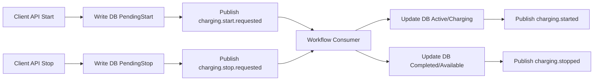

# EV Charge System (Docker + API + EF + MSSQL + MQ)

這是一個可直接啟動的「充電樁後端系統」範例專案，包含：

- ASP.NET Core Web API
- Entity Framework Core（SQL Server）
- RabbitMQ（流程事件 MQ）
- Docker Compose（一鍵啟動 API + MSSQL + RabbitMQ）

## 1. 系統目標

提供基本充電樁核心流程：

- 使用者認證（API Key）
- 預約充電
- 啟動充電
- 結束充電
- 查詢充電狀態與充電樁狀態

並透過 RabbitMQ 將流程拆成「API 命令 + 背景工作流事件處理」，方便後續擴充成分散式架構。

## 2. 技術架構

- API: ASP.NET Core 8 Web API
- ORM: EF Core 8 + SQL Server
- MQ: RabbitMQ topic exchange
- Infra: Docker Compose

### 主要服務

- `api`: `http://localhost:8080`
- `sqlserver`: `localhost:1433`
- `rabbitmq`: `localhost:5673`（容器內仍是 `5672`）
- RabbitMQ 管理頁: `http://localhost:15673` (`guest/guest`)

## 3. 專案結構

```
ev-charge-system/
  EvChargeSystem.Api/
    Controllers/
      AuthController.cs
      ChargingController.cs
    Data/
      ChargingDbContext.cs
    Infrastructure/
      ApiKeyMiddleware.cs
    Messaging/
      RabbitMqEventBus.cs
      IEventBus.cs
      Events.cs
      RabbitMqOptions.cs
    Models/
      Entities/
      Dtos/
    Services/
      DatabaseInitializerHostedService.cs
      ChargingWorkflowConsumer.cs
    Dockerfile
  docker-compose.yml
  README.md
```

## 4. 啟動方式（Docker）

在 `ev-charge-system` 根目錄執行：

```bash
docker compose up --build -d
```

查看服務狀態：

```bash
docker compose ps
```

若服務沒有正常起來，先看狀態與 logs：

```bash
docker compose ps
docker compose logs api --tail 200
docker compose logs rabbitmq --tail 200
docker compose logs sqlserver --tail 200
```

開啟 Swagger：

- `http://localhost:8080/swagger`
- `http://localhost:8080/`（會自動導向 Swagger，方便 debug）

## 5. API 使用流程

### 5.1 先建立帳號 / 拿 API Key

`POST /api/auth/register`

```json
{
  "userName": "alice"
}
```

回傳包含 `apiKey`，後續都放在 Header:

`X-Api-Key: <your-api-key>`

### 5.2 驗證 API Key

`POST /api/auth/validate`

```json
{
  "apiKey": "ev-xxxxxxxx"
}
```

### 5.3 查詢充電樁

`GET /api/charging/chargers`

### 5.4 預約充電

`POST /api/charging/reservations`

```json
{
  "chargerCode": "CP-001",
  "startAtUtc": "2026-03-13T08:00:00Z",
  "endAtUtc": "2026-03-13T10:00:00Z"
}
```

### 5.5 啟動充電

`POST /api/charging/start`

```json
{
  "chargerCode": "CP-001",
  "meterStartKwh": 1024.5
}
```

### 5.6 結束充電

`POST /api/charging/stop`

```json
{
  "sessionId": 1,
  "meterEndKwh": 1036.1
}
```

### 5.7 查詢充電會話

`GET /api/charging/sessions/{sessionId}`

## 6. MQ 流程規劃（重點）

目前實作的事件 routing key：

- `charging.start.requested`
- `charging.started`
- `charging.stop.requested`
- `charging.stopped`
- `charging.reservation.created`

### 建議的充電樁流程編排

1. API 收到 `start` 請求，寫 DB（session=`PendingStart`）後發出 `charging.start.requested`
2. Workflow Consumer 收到事件，更新 DB（session=`Active`, charger=`Charging`），再發出 `charging.started`
3. API 收到 `stop` 請求，寫 DB（session=`PendingStop`）後發出 `charging.stop.requested`
4. Workflow Consumer 收到事件，更新 DB（session=`Completed`, charger=`Available`），再發出 `charging.stopped`

## 7. 可擴充的 MQ 事件建議

你可以再加上以下事件，形成更完整的營運流程：

- `charging.auth.validated`
- `charging.reservation.expired`
- `charging.payment.requested`
- `charging.payment.completed`
- `charging.alarm.raised`（過熱、急停、通訊中斷）
- `charging.heartbeat.missed`

## 8. Mermaid 流程圖



## 9. 開發備註

- 目前使用 `EnsureCreated` 自動建表，適合 Demo/MVP。
- 正式環境建議改成 EF Migration。
- 目前認證採 API Key Middleware，正式環境可改 JWT + OAuth2。
- 密碼/API Key 等敏感資訊請改用 Secret Manager 或 Vault。

## 10. 快速測試（cURL 範例）

建立使用者：

```bash
curl -X POST http://localhost:8080/api/auth/register \
  -H "Content-Type: application/json" \
  -d '{"userName":"alice"}'
```

查充電樁：

```bash
curl -X GET http://localhost:8080/api/charging/chargers \
  -H "X-Api-Key: demo-api-key-12345"
```

---

如果你要，我可以下一步幫你補：

1. JWT 驗證與角色權限
2. EF Migration 與資料版本控管
3. 充電費率計算與帳務事件流
4. OCPP 對接模擬器
